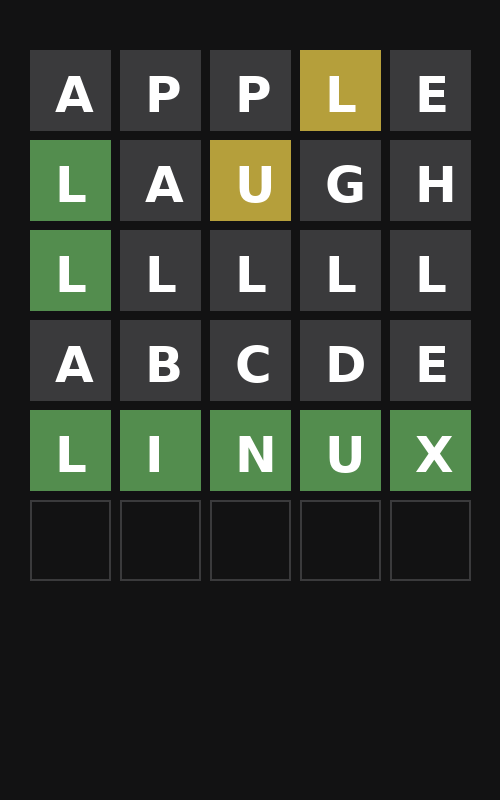

# Ray's GitHub Wordle

Welcome to my profile! This is a fully functional **Wordle** game running entirely on **GitHub Actions**.
The target word is a **5-letter** English word. Can you guess it?

### Current Board

---

### How to Play

1. **Click the button below** (It will open a new Issue).
2. Replace `XXXXX` in the title with your guess (e.g., `guess: GHOST`).
3. Click **"Submit new issue"** (No need to type anything in the body).
4. Wait for about **30 seconds**, then refresh this page to see the result!

### [Click Here to Make a Guess](https://github.com/rayhuang2006/readme-wordle/issues/new?title=guess%3A+XXXXX&body=Just+replace+XXXXX+in+the+title+with+your+5-letter+guess+and+click+Submit!)

---

### Game Info
* **Engine:** Python + Pillow (Image Generation)
* **Automation:** GitHub Actions (Issue Ops)
* **Refresh Rate:** Updates ~30s after interaction

### Rules
* **Green:** Correct letter in the correct spot.
* **Yellow:** Correct letter but in the wrong spot.
* **Gray:** The letter is not in the word.